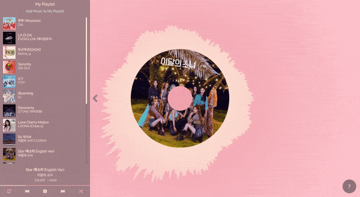

<h1 align="center">
	Spictrum
</h1>

	
	

## About Spictrum
Spictrum is a web music player with interactive audio spectrum.

    

## Features
<ul>
	<li>Choose your music and starts playing</li>
	<li>Audio spectrum visualizer</li>
</ul>

## Color Palette
<table>
<tr>
<td></td>
<td>#f4acb7</td>
</tr>
<tr>
<td></td>
<td>#ffcad4</td>
</tr>
<tr>
<td></td>
<td>#ffe5d9</td>
</tr>
</table>

## License
All code provided are under the [MIT License](http://opensource.org/licenses/MIT).

Copyright © 2020 Philip Andreas
